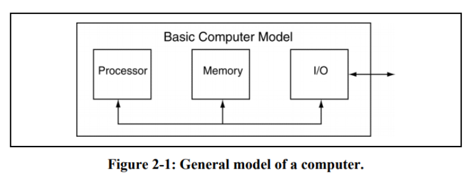

# Chapter 2: The Basic Computer in High-Level Terms

## 2.1 Introduction

### Main Chapter Topics

	- High-Level OVERVIEW of Computer Architecture: This chapter provides a
	  high-level overview of comp arch, which provides a context for the
information in this text

	- Computer Programming CONTEXT: this ch provides a context for the act of programming computer in terms of hardware, software and the human destine to interfact with them.

	- LEVELS of Programming: This chapter describes the various level possible for progamming computer.

	- Digital DESIGN Hierachy: this chpater provides a reminder of the path we have taken to arrive at the point of designing a computer

### Why This Chapter is Important

	This chapter is important because it provides a high-level overview of the course in terms of what you should already know. This provides a roadmap of the course.

## 2.2 What is a Computer ?

Computer: is a device that sequentially executes a stored program.

-> This device is generally some special set of hardware that someone has configured to operate in a useful way with the stored program.

The underlying facor is here is that as a result of executing a program well end up with some useful result.

-> we Consider the program to be software; this software executes on the
computers hardware. This defintion of a computer works for now. 

